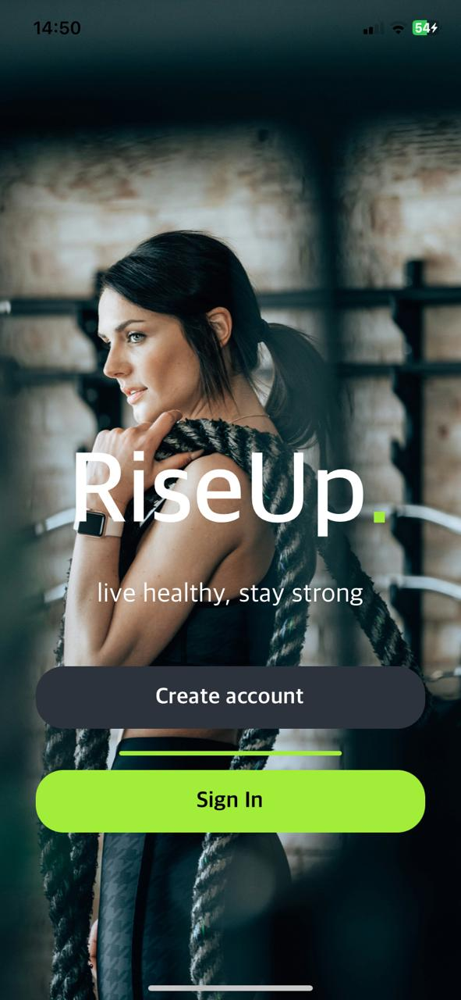

# Fitness Mobile App (RISE UP)

## Overview

Welcome to the Fitness Mobile App repository! This application is built using React Native and Expo Go for the frontend, with a backend powered by Node.js and Express.js. MongoDB is used as the database to store user and exercise data. The exercise dataset is sourced from the public repository: [free-exercise-db](https://github.com/yuhonas/free-exercise-db).



## Features

- **User Authentication**: Secure user login and registration.
- **Exercise Database**: Extensive collection of exercises with descriptions and images.
- **Workout Plans**: Create and manage personalized workout plans.
- **Progress Tracking**: Track your workout progress over time.
- **Award System**: Earn awards for achieving fitness milestones.
- **Calories Tracking**: Monitor your calorie intake and expenditure.
- **Responsive Design**: Smooth and intuitive user interface optimized for mobile devices.

## Tech Stack

- **Frontend**: React Native, Expo Go
- **Backend**: Node.js, Express.js
- **Database**: MongoDB
- **Testing**: Postman for API testing
- **Version Control**: Git and GitHub


## Installation

### Prerequisites

Ensure you have the following installed on your machine:

- Node.js
- npm or yarn
- MongoDB
- Expo CLI

### Backend Setup

1. Clone the repository:

   ```bash
   git clone https://github.com/your-username/fitness-app.git
   cd fitness-app/backend
2. Install the dependencies:
    ```bash
   npm install

3. Create a .env file in the backend directory and add your MongoDB URI::
    ```bash
   MONGO_URI=your-mongodb-uri
4. Start the server:
    ```bash
   node server.js


#Frontend Setup
1. Navigate to the frontend directory:
     ```bash
   cd ../frontend
2. Install the dependencies:
     ```bash
   npm install
3. Start the expo server:
     ```bash
   npm start
## Usage

1. Open the Expo Go app on your mobile device.
2. Scan the QR code displayed in the terminal after running `expo start`.
3. Register or log in to start using the app.

## API Endpoints

### User Authentication

- `POST /register` - Register a new user
- `POST /login` - User login

### User Profile

- `POST /difficulty` - Update user difficulty level
- `POST /uploadProfilePicture` - Upload user profile picture

### Health Tracking

- `POST /Weight` - Log user weight
- `POST /Calories` - Log calorie intake or expenditure
- `POST /addExerciseDate` - Add exercise date for user

## Screenshots

<div style="display: flex; flex-wrap: wrap; gap: 20px;">
    
    
    
    
    
    
    
    
    
    
    
    
    
</div>


## Contributing

Contributions are welcome! Please open an issue or submit a pull request.

## Acknowledgements

Thanks to [yuhonas](https://github.com/yuhonas) for the [free-exercise-db](https://github.com/yuhonas/free-exercise-db) repository.


